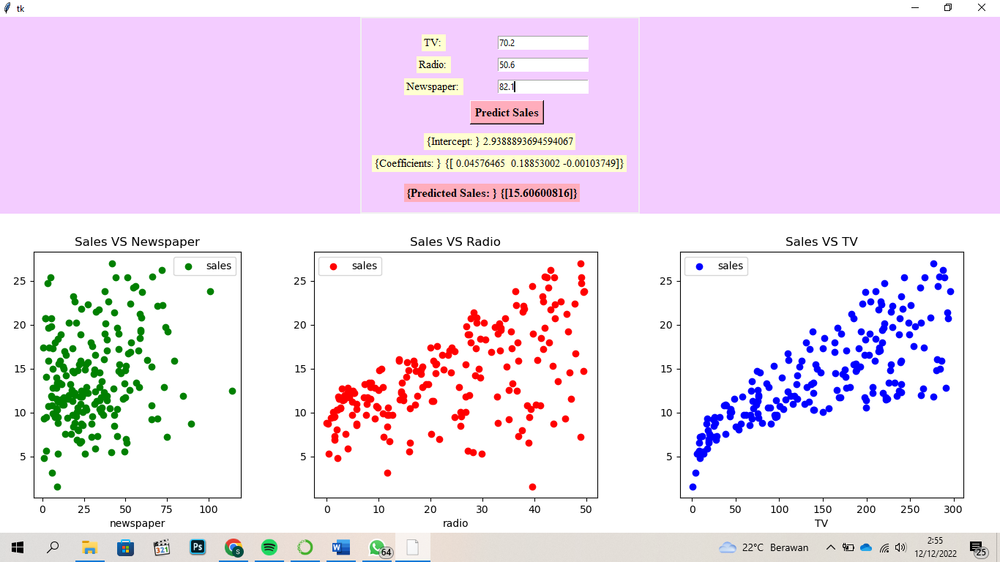

# Portfolio
---
### GUI Python for Multiple Regression Analysis

Multiple linear regression analysis is a regression model that involves more than one independent variable. Regression in this analysis is used to predict sales results based on advertising spending through TV, radio and newspaper media in the form of a Guide User Interface (GUI). The visualization uses a scatterplot which functions to see the relationship between variables.

 
The following are the steps for using the GUI:  
1. Input data 
2. Enter the values for the TV, radio, and newspaper variables 
3. Click "Predict Sales"

